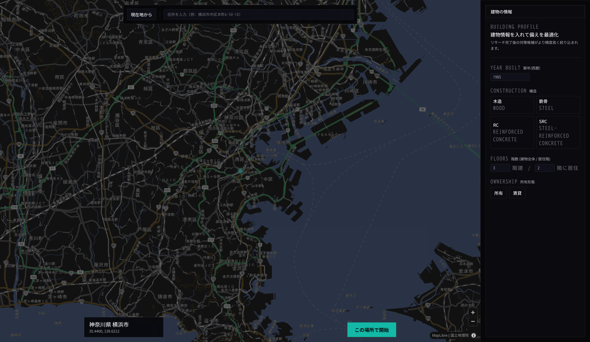
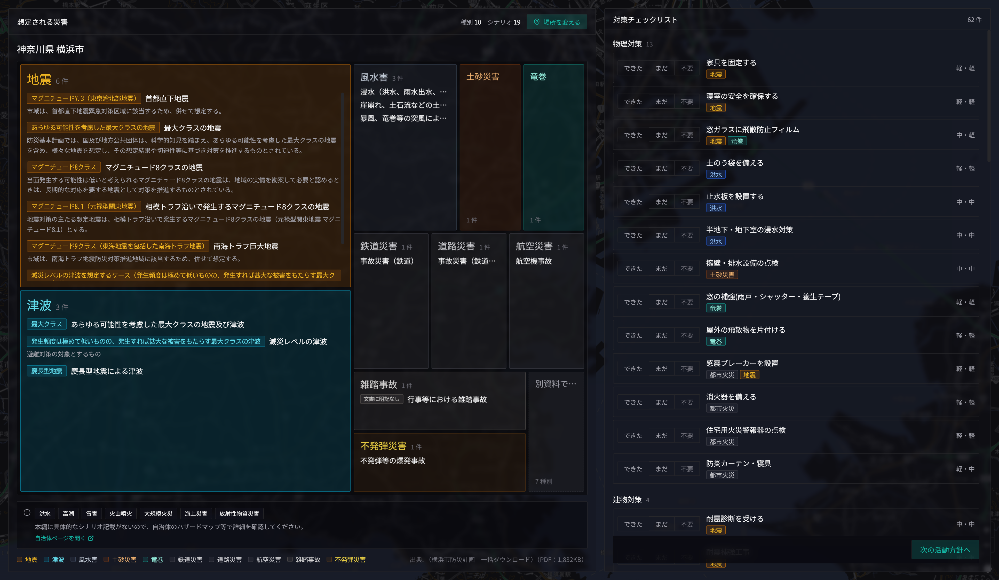
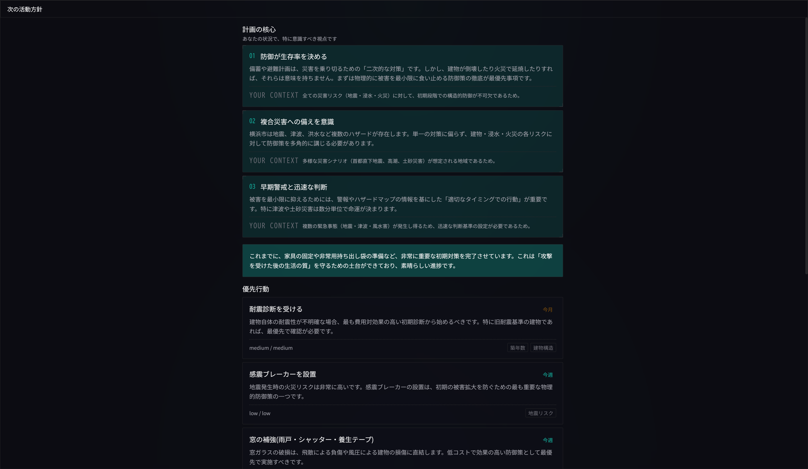

# Sonae


> *Pre-disaster preparedness, fitted to your block and household.*

---

## Overview

Sonae is a Next.js + TypeScript app that resolves a Japanese municipality
from a GPS coordinate, address, or map click, downloads that city's
official regional disaster plan PDF, OCRs the expected-damage section, and
asks Gemma 4 to produce countermeasure recommendations adjusted to the
user's building age, household composition, and location.

It is also an OSS reference implementation of a more general pattern:
small LLMs + structured extraction + scattered public sources. The same
Pipeline runs the disaster app and the `examples/news-summarizer/` example
(HTTP + HTML + LLM, no PDF / OCR), demonstrating the framework's
domain-independence in code rather than only in description.

> ⚠ **Sonae is a working prototype, not a production system. In an actual
> emergency, follow JMA and municipal authoritative information first.**

---

## The Challenge

Each of Japan's 1,741 municipalities publishes its own regional disaster
plan as a 100–500 page PDF. Every plan contains an expected-damage chapter
with the design earthquake, maximum tsunami / flood depth, assumed wind
speed, expected casualty counts, and expected building collapses for that
location.

The information exists, but residents rarely use it. The PDFs are long,
their URLs are scattered, table-of-contents structure varies between
cities, and many are scanned-image PDFs with no text layer.

So residents fall back on generic "have a 3-day stockpile" advice that
ignores their building age, family composition, and the actual hazards
their city faces. Stockpile alone is no help if the building collapses in
the first 30 seconds, and the local plan often says so explicitly in a
chapter nobody reads.

The app sits in the Global Resilience track because it tries to close that
gap between the published risk information and what residents can act on.

---

## Our Solution

Sonae extracts the expected-damage section, normalizes it into a typed
assessment, and lets Gemma 4 produce per-resident priority actions
weighted by a three-tier model:

- **Tier 1 (defense)**: physical hardening: seismic retrofit, furniture
  securing, seismic breakers, water-stop boards, roof lightening
- **Tier 2 (preparation)**: hazard map awareness, evacuation triggers,
  family contact, warning subscriptions
- **Tier 3 (post-event coping)**: water / food / portable toilet stockpile

The prompt requires at least one Tier 1 insight per recommendation set,
because pre-event hardening has the largest effect on survival.

### Key Features

- One-tap municipality resolution: GPS, address, or map click. Designated-city wards (~150 wards across 20 cities) resolve to their parent city automatically.
- Live PDF discovery: Playwright finds the plan for un-registered cities. Registered cities use the direct URL.
- Multimodal OCR fallback for scanned-image PDFs.
- Every pipeline LLM call returns Zod-validated structured output.
- Map-reduce extraction: enumerate disaster types, then extract scenarios per type in parallel.
- Five cache tiers with content-based invalidation; re-runs are ~10 ms when the upstream PDF hasn't changed.
- Source attribution: every datum links to the official PDF page that produced it.
- User profile lives in `localStorage`. Only the recommendation call sees it.
- No numerical scores. The app shows facts and lets the user judge.

---

## Privacy

The pipeline is built so that, by default, no personal data leaves the
user's device — and on-device inference is supported end-to-end so the
default can be made strict.

- **Profile (building age, household composition, lifestyle) is stored
  only in browser `localStorage`.** It is never persisted on the server.
  It is read into memory only when `/api/next-actions` is called, and is
  forwarded only to the LLM endpoint configured by the operator (which can
  be local).
- **No user accounts, no signup, no email collected.** There is no
  identity layer.
- **No third-party analytics, no tracking scripts, no advertising SDKs.**
  Outbound network calls from the app go only to: the configured LLM
  endpoint, the configured OCR endpoint, and the municipality's own PDF
  host. Nothing else.
- **The cache is keyed by municipality code, not by user.** Two residents
  of the same city share a single cached assessment; the cache contains
  nothing that identifies a person.
- **Public sources only.** The pipeline only fetches the official
  municipal disaster plan, which is public information published by the
  municipality.
- **On-device inference end-to-end.** Pointing the LLM and OCR endpoints
  at a local Gemma 4 4B + a local vision model (LM Studio, Ollama, vLLM,
  …) means the user profile is processed without any data leaving the
  device, and the app remains usable during a network outage — exactly
  when a disaster-preparedness tool needs to keep working.
- **`/admin` is auth-gated and disabled by default.** The admin panel
  returns 503 when admin credentials are not set.

For organizational adopters: there is no telemetry channel to remove, no
cookie banner is required (no tracking cookies are set), and the framework
parts in `lib/core/` make it straightforward to swap the storage layer
(e.g., to a tenant-scoped backend) without changing the LLM logic.

---

## Why Gemma 4

Sonae's LLM client is OpenAI-compatible, so the pipeline could in principle
run on any chat completion endpoint. Gemma 4 was chosen for three reasons
that other options (proprietary cloud APIs, smaller open models) don't
satisfy together:

1. **Apache 2.0 license**. Outputs are unrestricted, which matters for an
   app that prints recommendations into a PDF a resident may share or
   archive. Most cloud APIs put usage restrictions on outputs.
2. **On-device viable**. Gemma 4 4B runs locally on consumer hardware. A
   disaster-preparedness tool that requires an internet round-trip during a
   network outage is a contradiction; on-device inference keeps the app
   useful in the situation it is preparing the user for, and keeps the user
   profile from ever leaving the device.
3. **Size variations in the same family**. The 4B and 26B-A4B variants
   share a tokenizer and prompt style, so the same prompts work across
   sizes. Sonae uses 4B for the high-volume calls (Step B per-disaster
   extraction, next-actions generation) and 26B-A4B only for the
   precision-sensitive roles (TOC selection, Step A enumeration, chat tool
   selection). Cost and latency are tunable per role without rewriting the
   pipeline.

---

## How We Used Gemma 4

### 1. Multimodal vision OCR

When a PDF has no text layer, the parser renders each page to PNG, sends
it to a vision model, and uses the returned markdown as the document body.
The reference deployment uses a dedicated OCR model, but Gemma 4's
multimodal capability lets a single model family cover this step in
deployments that prefer that.

### 2. Structured output (Zod schemas)

Every LLM call in the pipeline is constrained by a Zod schema in
`src/lib/sonae/schemas.ts`. Gemma 4's structured output is what lets a 4B
model drive the pipeline reliably:

- Discovery: pick the correct PDF from a candidate list (1 call)
- TOC selection: pick the expected-damage chapter from the table of contents (1 call)
- Step A: enumerate which of 23 disaster types this city faces (1 call)
- Step B: for each detected type, extract scenarios in parallel
- Next actions: priority actions with reasoning, urgency, and effort (1 call)

### 3. Function calling (post-evaluation chat)

After the pipeline finishes, the chat panel on the results screen exposes
five tools to the model:

- `list_disaster_types` — what disasters the assessment found
- `get_disaster_scenarios(disaster_type)` — scenarios for a given type
- `search_disaster_plan(keywords[])` — character-bigram search over the OCR markdown
- `list_countermeasures_for_disaster(disaster_type)` — filter the 74-item master
- `lookup_countermeasure(id)` — full record for one countermeasure

`streamText` with `stopWhen: stepCountIs(8)` lets the model call tools,
inspect results, and call more before answering. Retrieval is character
bigrams over chunked markdown; there is no embedding model and no vector
store. That's enough for the corpus size and keeps the deployment to a
single LLM endpoint plus an OCR endpoint.

### 4. Role-based model routing

`src/lib/sonae/llmRoles.ts` resolves a model per role: `main`, `discovery`,
`toc`, `step_a`, `next_actions`, `chat`, `ocr`. Each role falls back to
`main` if not overridden. Each role takes its own `(baseURL, apiKey, model)`
triple via env vars, so a small fast model can run most calls and a larger
model can handle the precision-sensitive roles (TOC selection, Step A,
chat tool selection) without code changes. Any OpenAI-compatible endpoint
works on any role (LM Studio, Ollama, vLLM, OpenRouter, LiteLLM proxy,
etc.).

---

## Tech Stack

| Layer | Stack |
|---|---|
| LLM | Gemma 4 4B for most calls; Gemma 4 26B-A4B for precision roles. Any OpenAI-compatible endpoint (LM Studio, Ollama, vLLM, OpenRouter, LiteLLM proxy, …) |
| LLM client | Vercel AI SDK (`@ai-sdk/openai-compatible` + `generateObject` / `generateText` / `streamText`) |
| Chat / tools | Vercel AI SDK `tool()` + `useChat` + `DefaultChatTransport` |
| Vision OCR | OpenAI-compatible vision endpoint (model in `.env.example`) |
| Frontend | Next.js 15 (App Router), TypeScript, Tailwind, Zustand |
| Mapping | MapLibre GL JS, GSI (Geospatial Information Authority of Japan) tiles |
| Pipeline | Discoverer / Retriever / Parser / Extractor with cache layers |
| Retrieval (chat) | Character-bigram score over chunked OCR markdown |
| PDF | pdfjs-dist, @napi-rs/canvas |
| Discovery | rebrowser-playwright + system Chrome |
| Schemas | Zod (JSON Schema is derived by AI SDK) |
| Reporting | html2canvas + jsPDF; react-markdown + remark-gfm for chat output |
| Tests | Vitest, Prettier, ESLint, `tsc --noEmit` strict |

### Architecture

```
            query                     structured result
              │                              ▲
              ▼                              │
     ┌──────────────────────────────────────────────────┐
     │                Pipeline (core)                   │
     │   Discover ── Retrieve ── Parse ── Extract       │
     │      │           │           │          │       │
     │   ┌──┴──┐    ┌──┴──┐    ┌──┴──┐   ┌──┴──┐     │
     │   │cache│    │cache│    │cache│   │cache│     │
     │   └─────┘    └─────┘    └─────┘   └─────┘     │
     └──────────────────────────────────────────────────┘
                                                 ▲
                                          freshness check
                                       (HTTP HEAD / etag / ...)
```

The four interfaces in [`src/lib/core/types.ts`](src/lib/core/types.ts)
form the public contract. The Sonae app is one implementation; the
framework is reusable for medical PDFs, legal texts, educational
curriculum, or other places a small LLM has to consolidate fragmented
public sources. See [`docs/EXTENDING.md`](docs/EXTENDING.md) and
[`examples/news-summarizer/`](examples/news-summarizer/).

#### Cache tiers

Five tiers, content-based invalidation (no time TTL):

| Tier | Path | Skipped if hit | Notes |
|---|---|---|---|
| 1. Result | `cache/municipalities/{code}.json` | Everything | ~10 ms re-run |
| 2. Parsed | `cache/ocr/{code}.{md,meta.json}` | Discovery / Retrieval / Parser | OCR markdown kept long-term (RAG-ready) |
| 3. Source | `cache/discovery/{code}.json` | Discovery only | The picked PDF target |
| 4. Blob | `cache/pdfs/{code}.pdf` + `.meta.json` + `.http.json` | Retrieval only | HEAD-checked before reuse |
| 5. Work | `cache/work/{code}_{ts}/` | (debug only) | toc.md, page PNGs, ocr_combined.md |

Source freshness is checked with an HTTP HEAD on the PDF URL
(`Last-Modified` / `ETag` / `Content-Length`). On a `'stale'` verdict the
parsed and result tiers are invalidated cascade-style.

Query parameters: `?force=1` (bypass all caches), `?force_ocr=1` (bypass
parsed + result, keep upstream).

---

## Quick Start

### Prerequisites

- Node.js 20+ (also tested on 22.x via CI).
- An OpenAI-compatible LLM endpoint serving a small instruction-tuned LLM
  (Gemma 4 4B class) and a vision model for OCR.
- For the precision-sensitive roles (TOC selection, Step A, chat), a
  larger model is recommended (Gemma 4 26B-A4B class). Any OpenAI-compatible
  endpoint works.

The exact model identifiers used in the reference deployment are in
[`.env.example`](.env.example). Other OpenAI-compatible endpoints work; set
the per-role env vars to whichever provider you use.

### Install and run

```bash
git clone https://github.com/couzip/sonae.git
cd sonae
npm install                       # postinstall fetches Playwright Chromium
cp .env.example .env              # tune endpoints if needed

npm run dev                       # http://localhost:3000
```

### Required dev commands

```bash
npm run typecheck     # tsc --noEmit
npm run lint          # next lint
npm run format:check  # prettier --check
npm run test          # vitest run
```

CI runs all four on Node 20.x and 22.x. See `.env.example` for the full
list of environment variables (per-role LLM overrides, OCR endpoint, admin
panel credentials, cache root).

---

## Demo & Screenshots

> **Video walkthrough**: <https://www.youtube.com/watch?v=x13MlYLpE60>
> **Kaggle writeup**: <https://www.kaggle.com/competitions/gemma-4-good-hackathon/writeups/sonae-survive-before-it-strikes>
> **Live demo**: _linked at submission_

### Screenshots

**1. Place picker — pick your location, fill in your building**



**2. Disaster grid — what your municipality says will happen**



**3. Next actions — priority recommendations fitted to your profile**



Demo flow:

1. Pick a location (GPS, address autocomplete, or map click). The building
   form is in the side panel, so a cache hit on later phases doesn't skip
   the input opportunity.
2. Watch the pipeline progress over SSE: Discovery → Retrieval → TOC →
   OCR → Extract.
3. Look at the disaster grid (treemap of detected disaster types).
4. Drill into a disaster type for scenarios and source-page citations.
5. Fill in household / lifestyle profile (kept in `localStorage`).
6. Read the priority actions with reasoning.
7. Ask follow-up questions in the chat panel.
8. Export a per-resident PDF report.

---

## Validation

The pipeline has been run end-to-end against **49 Japanese municipalities**
to date, with cache artifacts (`pdfs/`, `ocr/`, `municipalities/`) preserved
on disk. The table below samples nine, weighted toward the **Nankai Trough
corridor** (Shizuoka, Aichi, Mie, Tokushima, Kōchi) plus a mixed-PDF outlier
(Fujiyoshida).

| Code | Municipality | Region | PDF KB | Section pp. | OCR pp. | OCR chars | Disaster types | Cached rerun (ms, n=3) | Manual check |
|---|---|---|---:|---:|---:|---:|---:|---:|---|
| 14100 | Yokohama | Sagami Trough | 1,832 | 2 | 2 | 2,526 | 17 | 181 | ok |
| 22100 | Shizuoka | Suruga Bay / Nankai | 7,991 | 6 | 6 | 6,130 | 19 | 151 | ok |
| 22139 | Hamamatsu (Hamana ward) | Nankai | 4,763 | 13 | 13 | 62,852 | 12 | 160 | ok (TOC-only inference) |
| 22203 | Numazu | Suruga Bay | 3,060 | 4 | 4 | 4,142 | 4 | 194 | **under-extracted** |
| 23201 | Toyohashi | Ise Bay / Nankai | 530 | 2 | 2 | 1,386 | 5 | 215 | ok |
| 24201 | Tsu | Ise Bay / Nankai | 9,378 | 1 | 1 | 277 | 5 | 183 | ok |
| 39201 | Kōchi | Nankai (direct) | 2,959 | 2 | 2 | 1,545 | 7 | 152 | ok |
| 36201 | Tokushima | Nankai | 14,170 | 21 | 21 | 18,334 | 3 | 219 | **suspected over-extraction** |
| 19202 | Fujiyoshida | Mt. Fuji eruption zone | 240 | 7 | 5 (mixed) | 4,726 | 3 | 282 | ok (TOC-only inference) |

**What this shows:**

- **OCR is the main path, not a fallback.** 48 of the 49 municipalities had
  no usable text layer in the expected-damage section and required Gemma 4
  multimodal vision OCR. Fujiyoshida is the only mixed case in the sample
  (5 of 7 pages were OCR'd, the rest read directly).
- **Pipeline scope is wide.** PDF sizes 240 KB → 14 MB, OCR output 277 →
  62,852 characters per municipality, detected disaster types 3 → 19. The
  OCR + structured-output stages absorb that variance without per-city
  tuning.
- **Cached rerun is sub-300 ms.** Once a plan is processed, the result JSON
  sits in `cache/municipalities/{code}.json`; the SSE pipeline emits
  `cache_hit` and returns the full assessment in 150-300 ms (mean of three
  runs, against a local Next.js server). The LLM is on the cold path only.
- **Manual check: 7 / 9 ok, 2 / 9 problems found.** Each municipality's
  extracted `disaster_type` set was diffed against the OCR'd source text.
  Two cases are recorded honestly here rather than hidden:
  - **22203 Numazu (under-extracted).** The source plan lists 9 disaster
    categories (wind/flood, storm surge, **earthquake & tsunami**, landslide,
    **fire & explosion**, drowning, traffic, **volcanic**, compound). Sonae
    only extracted the 4 wind/flood-class entries; earthquake/tsunami,
    landslide, fire, and volcanic were missed. This is a Step-A enumeration
    regression and is exactly the kind of failure the table is meant to
    surface.
  - **36201 Tokushima (suspected over-extraction).** The 21-page section is
    dominated by Nankai Trough earthquake / tsunami damage estimates;
    "volcanic eruption" appears in the Sonae output but cannot be confirmed
    in the OCR text we have. Likely a model hallucination on a sparsely
    populated category, not a critical failure.
- **What this method does *not* prove.** Section coverage was checked by
  reading the OCR'd "expected damage" chapter, not every page of every plan.
  A municipality that catalogs hazards in a different chapter (e.g., a
  separate earthquake-only document) might still have items missed upstream
  of the section selector. Closing that gap is on the post-submission list.

The 49-municipality cache is reproducible: `data/municipalities.yaml` seeds
the registry, the LLM endpoints are env-configurable, and
`/admin/municipalities/{code}` re-runs any city's pipeline in strict or
full-OCR mode. Two helper scripts in `scripts/` (`inspect-cache.mjs` and
`measure-cached-rerun.mjs`) regenerate the table data from the on-disk cache.

---

## Impact & Evaluation

### Why this matters

Japan's 1,741 municipalities already publish detailed risk information in
their disaster plans. Sonae's role is to make that information usable for a
resident in a few minutes:

- The pipeline scales to all of them (per-city caching, content-based
  invalidation).
- Designated-city wards (~150 wards across 20 cities) resolve to their
  parent city via `data/seirei_wards.json`, so residents searching for a
  ward reach the parent city's plan automatically.
- Recommendations are ordered to put physical hardening first, since
  hardening has the largest effect on outcomes once an event happens.

### Limitations

- Discovery for un-registered cities falls back to a Playwright-driven
  Google search. It works, but per-prefecture sitemap crawling or a paid
  search API is the upgrade path. Cities with a registry entry never hit
  this fallback.
- The reference deployment uses Gemma 4 4B and a vision model for OCR
  (identifiers in `.env.example`). Other OpenAI-compatible models work but
  may need prompt tuning for strict JSON Schema output.

---

## Repository Structure

```
src/
├── lib/
│   ├── core/                 # Framework (domain-agnostic, OSS-reusable)
│   │   ├── Pipeline.ts          generic pipeline runner with cache layers
│   │   ├── types.ts             Discoverer / Retriever / Parser / Extractor / Cache / Freshness
│   │   ├── llm.ts               AI SDK facade (chatJson via Zod + chatVision + raw languageModel)
│   │   ├── pdf.ts               pdfjs-dist wrappers (text extract + render via @napi-rs/canvas)
│   │   ├── fileCache.ts         JsonFileCache / TextFileCache / BinaryFileCache / PathHandleCache
│   │   ├── httpFreshness.ts     HEAD-based freshness checker
│   │   ├── repairJson.ts        truncated-JSON recovery (utility)
│   │   ├── events.ts            ProgressEvent + EmitFn
│   │   └── index.ts
│   │
│   ├── sonae/                # Disaster domain
│   │   ├── discoverer.ts        municipality registry + Playwright Discovery
│   │   ├── retriever.ts         PDF download with HTTP headers captured
│   │   ├── parser.ts            TOC → LLM section pick → keyword scan → partial OCR
│   │   ├── extractor.ts         map-reduce: enum disaster types → per-type scenarios
│   │   ├── pipeline.ts          configured Pipeline + cache wiring
│   │   ├── countermeasures.ts   YAML loader for the 74-item countermeasure master
│   │   ├── municipality.ts      municipalities.yaml registry
│   │   ├── nextActions.ts       LLM call for strategic insights + priority actions
│   │   ├── chat.ts              5 RAG tools + system prompt for the post-evaluation chat
│   │   ├── llmRoles.ts          role-based LLM resolver
│   │   ├── schemas.ts           Zod schemas
│   │   ├── types.ts
│   │   └── index.ts
│   │
│   ├── countermeasures-filter.ts   client-safe filter (no node imports)
│   ├── disaster-mapping.ts         JP name ↔ enum
│   ├── geocode.ts                  GSI reverse geocode
│   ├── treemap/squarify.ts         d3-hierarchy adapter
│   └── utils.ts
│
├── components/
│   ├── chat/QueryBar.tsx        useChat-driven chat panel with tool-call rendering
│   ├── screens/HomeShell.tsx    phase-aware top-page layout (BuildingForm side panel on pick)
│   └── …                        HUD primitives, treemap, profile forms, etc.
├── stores/                   # Zustand
└── app/                      # Next.js App Router (5 screens + 5 API routes + admin)

data/
├── countermeasures.yaml         # 74-item countermeasure master
├── municipalities.yaml          # registry
└── seirei_wards.json            # JIS X 0402 ward → parent city map (designated cities)

docs/
└── EXTENDING.md                 # how to fork the framework for a new domain

examples/
└── news-summarizer/             # minimal pipeline (HTTP + HTML + LLM, no PDF/OCR)
```

### API routes

| Path | Method | Purpose |
|---|---|---|
| `/api/lookup` | POST | address / coordinates → municipality code |
| `/api/disasters` | GET | run pipeline, stream SSE progress events |
| `/api/checklist` | GET | filter the 74-item countermeasure master by detected disasters |
| `/api/next-actions` | POST | profile + checklist state → strategic insights + priority actions |
| `/api/ask` | POST | post-evaluation chat: `streamText` + 5 RAG tools, returns AI SDK UI message stream |
| `/api/admin/*` | various | admin panel (auth-gated) |

### Adding a municipality

`data/municipalities.yaml` is hand-curated:

```yaml
- code: '<5-digit JIS code>'
  name: <Japanese name>
  prefecture: <prefecture name>
  prefecture_code: '<2-digit>'
  lat: <lat>
  lng: <lng>
  name_aliases: [<alternate spellings for fuzzy match>]
  disaster_plan_url: <direct PDF URL>
  disaster_plan_label: <human label>
  disaster_plan_page_url: <citing source page>
```

`disaster_plan_url` skips the Playwright Discovery layer. Use it whenever
a stable URL is available (faster, deterministic, no Google search
dependency).

---

## License

MIT — see [LICENSE](LICENSE).

The framework parts in `src/lib/core/` are intended to be domain-agnostic;
disaster-specific logic lives in `src/lib/sonae/`. See
[CONTRIBUTING.md](CONTRIBUTING.md).

### Credits

- Geospatial Information Authority of Japan (GSI) — map tiles, geocoder
- Mozilla pdf.js — PDF parsing
- @napi-rs/canvas — Node.js canvas
- LM Studio — local model serving
- Google DeepMind — Gemma 4

---

## Links

- [The Gemma 4 Good Hackathon (Kaggle)](https://www.kaggle.com/competitions/gemma-4-good-hackathon)
- [Gemma 4 model on Kaggle](https://www.kaggle.com/models/google/gemma-4)
- [Gemma cookbook (Google)](https://github.com/google-gemma/cookbook)
- [GSI maps and geocoding API](https://www.gsi.go.jp/)
- [LM Studio](https://lmstudio.ai/)
